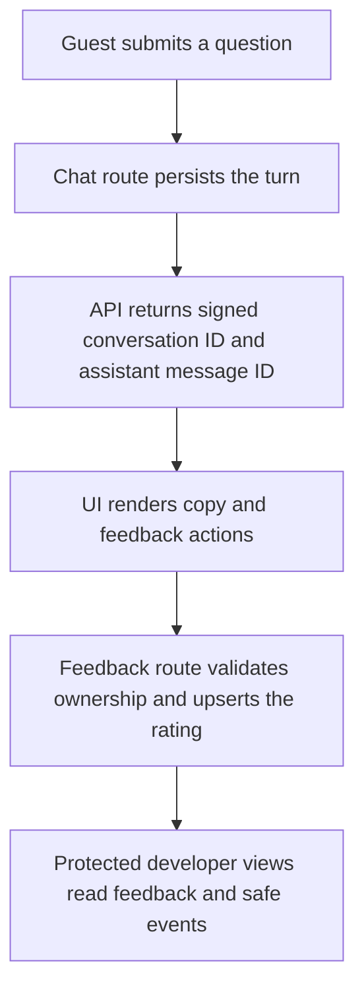

# Phase 7 Step 4 - Response Feedback and Privacy-Safe Monitoring

This increment turns the Phase 7 interface into an observable learning loop.
Public reviewers can copy any chat message and rate a persisted assistant
response, while developers can inspect response-level feedback and operational
events through protected, read-only views.

The design keeps feedback tied to a real assistant message, keeps guest access
isolated by browser session, and prevents monitoring data from becoming a
second store for prompts, credentials, or user identifiers.

## What this step delivers

- helpful and not-helpful controls for every persisted assistant response;
- optional citation, scope-decision, and comment feedback;
- idempotent feedback updates keyed by the assistant message identifier;
- copy controls for both user requests and assistant responses;
- protected feedback totals, filters, pagination, and response context;
- bounded operational event storage with privacy validation and redaction;
- a protected monitoring-events API for later dashboards and diagnostics;
- explicit assistant-message identity for grounded and deterministic replies.

## End-to-end flow



The response identifiers are the key boundary in this flow. The UI does not
invent a feedback target from its display order. The API returns the UUID of
the persisted assistant message, and the feedback repository verifies that the
message belongs to the validated guest conversation before writing anything.

## Public feedback experience

Each eligible response starts with a one-click rating:

- `👍 Helpful` stores rating `1`;
- `👎 Not helpful` stores rating `-1`;
- selecting another rating updates the same feedback record;
- the selected rating remains visible after Streamlit rerenders;
- an optional form records citation helpfulness, scope-decision correctness,
  and a comment of up to 1,000 characters;
- citation helpfulness appears only when the response contains citations.

The UI uses the signed conversation identifier, persisted assistant-message
UUID, browser-session identifier, and server-side UI secret when submitting
feedback. Safe user-facing errors distinguish invalid, unauthorized, missing,
rate-limited, unavailable, and malformed-response conditions without exposing
backend exceptions.

## Copy actions

User requests and assistant responses expose the same accessible `Copy`
control. Message text is UTF-8 encoded before it is inserted into the HTML
component, so untrusted message content is not treated as executable markup.
The control uses the browser clipboard API when available and a guarded legacy
fallback otherwise. A live status region reports `Copied` or `Copy failed`.

The initial icon-only control inherited an invisible colour in the dark theme.
Browser acceptance testing caught what HTML-string unit tests could not. The
final control therefore uses an explicit theme-aware colour, border, and text
label. This is a useful reminder that a rendered UI needs visual acceptance in
addition to structural tests.

## Feedback persistence contract

`FeedbackRepository.upsert()` applies the following rules atomically:

1. The rating must be exactly `-1` or `1`.
2. Blank comments normalize to `null`; non-blank comments are capped at 1,000
   characters.
3. The target must be a persisted message with role `assistant`.
4. The target message must belong to a conversation owned by the validated
   guest session.
5. `assistant_message_id` is the conflict key, so a later submission replaces
   the earlier values instead of creating a duplicate.
6. Any failure rolls the transaction back.

Deterministic guardrail responses, including out-of-scope replies, are also
persisted and return an assistant-message UUID. They can therefore be copied,
rated, and inspected through the same path as grounded RAG responses.

## Developer feedback workspace

The developer navigation includes a protected **Response Feedback** page. It
is deliberately read-only and provides:

- totals for rated responses and comments;
- helpful, citation-helpful, and scope-correct rates;
- rating, citation, and scope filters;
- pagination in pages of 25 records;
- the user question and assistant response associated with each rating;
- persisted citations, scope status, model name, latency, and submission time.

The developer projection excludes guest-session and conversation identifiers.
It offers no feedback modification or deletion controls.

## Operational monitoring contract

Operational events are best-effort and fail open: if an event cannot be
stored, the primary chat or feedback request continues. Current producers
record events such as:

- `chat.prompt_injection_blocked`;
- `chat.scope_decided`;
- `chat.request_failed`;
- `chat.query_received`;
- `chat.response_completed`;
- `chat.guardrail_evaluated`;
- `feedback.submitted`;
- `feedback.submission_failed`.

Event types and severities are normalized before storage. Properties must be
bounded JSON: at most 8,192 encoded bytes, four nesting levels, 100 items, and
512 characters per string. Non-finite numbers and unsupported values are
rejected.

Sensitive property names are rejected at write time and removed again when
events are read. The denylist covers prompts, queries, content, error messages,
stack traces, authorization values, credentials, email addresses, user IDs,
session IDs, and common secret or token suffixes. Compatibility logging methods
store lengths, booleans, confidence values, and safe labels instead of raw
queries, responses, identities, or exception messages.

## API surface

| Method and path | Access | Purpose |
| --- | --- | --- |
| `POST /api/chat/` | Guest session | Returns the response, signed conversation ID, and persisted assistant-message UUID. |
| `POST /api/feedback/` | Guest session | Creates or replaces feedback for one owned assistant response. |
| `GET /api/feedback/stats` | Developer key | Returns protected aggregate feedback counts. |
| `GET /api/feedback/` | Developer key | Lists response feedback with safe response context and optional filters. |
| `GET /api/monitoring/events` | Developer key | Lists recent privacy-safe operational events. |

Feedback-list requests accept `limit` from 1 to 100, a non-negative `offset`,
and optional rating, citation-helpfulness, and scope-correctness filters.
Monitoring requests accept the same limit and offset bounds, a time window from
1 to 720 hours, and optional event-type and severity filters.

## Primary code map

| Area | Files |
| --- | --- |
| Public feedback API | `api/routes/feedback.py`, `api/schemas/feedback.py` |
| Feedback persistence | `pliris/database/repositories/feedback.py` |
| Feedback UI and clients | `app/components/response_feedback.py`, `app/response_feedback.py`, `app/services/feedback_client.py` |
| Developer inspection | `app/developer_pages/3_Feedback.py`, `app/services/developer_feedback_client.py`, `app/feedback_view.py` |
| Monitoring contracts | `pliris/monitoring/contracts.py`, `pliris/monitoring/events.py` |
| Monitoring persistence/API | `pliris/database/repositories/monitoring.py`, `api/routes/monitoring.py`, `api/schemas/monitoring.py` |
| Message actions and identity | `app/components/chat_message.py`, `app/pages/1_Chat.py`, `app/services/chat_client.py`, `api/routes/chat.py` |

This step uses the existing `user_feedback`, `messages`, `conversations`, and
`monitoring_events` tables. It introduces no database migration.

## Configuration and local startup

The base project setup in `README.md` remains authoritative. For this step,
ensure `.env` contains the normal Supabase and OpenAI configuration plus these
server-side interface values:

```dotenv
GUEST_UI_SHARED_SECRET=replace_with_a_long_random_secret
DEVELOPER_UI_ACCESS_KEY=replace_with_a_long_developer_access_code
```

Start the public UI, API, and protected developer UI with Docker Compose:

```bash
docker compose --profile developer up --build
```

Then open:

- public chat: `http://localhost:8501`;
- developer workspace: `http://localhost:8502`;
- FastAPI documentation: `http://localhost:8000/docs`.

Plain `docker compose up --build` starts only the API and public UI.

## Verification

Run the complete automated gate from the repository root:

```bash
uv run ruff check .
uv run pytest -q
git diff --check
git status --short
```

The Step 4 completion gate recorded on 2026-08-05 produced:

- `440 passed` with five non-blocking dependency deprecation warnings;
- no whitespace errors from `git diff --check`;
- successful Docker builds for the API and Streamlit images;
- HTTP `200 OK` for the tested chat and feedback requests.

Manual public-UI acceptance confirmed that:

- the out-of-scope guard returns the approved deterministic response;
- `Copy` appears below the user request and beside response feedback;
- both copy controls place the exact message on the clipboard;
- each control temporarily reports `Copied`;
- helpful/not-helpful feedback persists after rerendering;
- no duplicate actions appear.

For the protected workspace, also verify that feedback totals and filters load,
response context is readable, monitoring filters return only safe projections,
and guest-session identifiers are absent.

## Commit sequence

| Commit | Increment |
| --- | --- |
| `3c738b5` | Response feedback persistence API |
| `f285a49` | Response-level feedback controls |
| `ccd1d6b` | Protected developer feedback inspection workspace |
| `c859fd4` | Protected monitoring event storage |
| `8395bec` | Privacy-safe operational instrumentation |
| `f7caecf` | Universal chat actions and explicit feedback identity |
| `fd57cd4` | Dark-theme copy-control visibility fix |

Together these commits changed 44 files relative to `abc00d1`, with 4,059
insertions and 363 deletions. The sequence remains split into reviewable
increments so persistence, UI, developer inspection, monitoring, and live
acceptance can each be traced independently.
