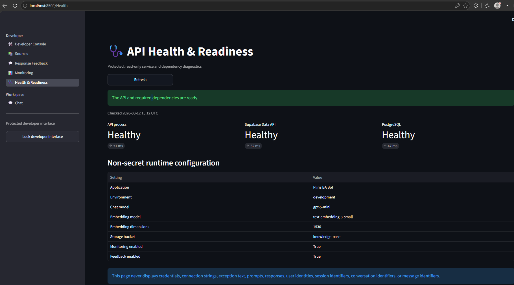
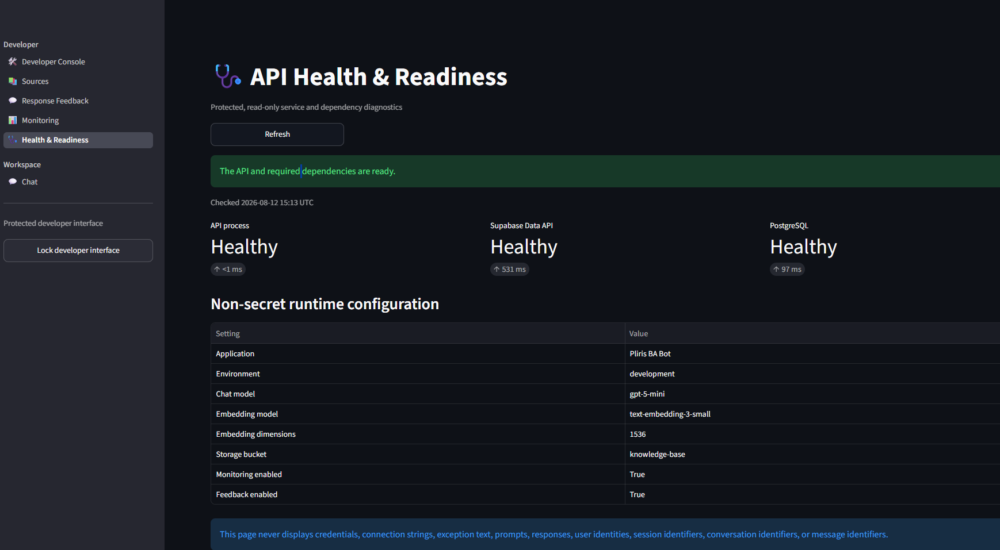
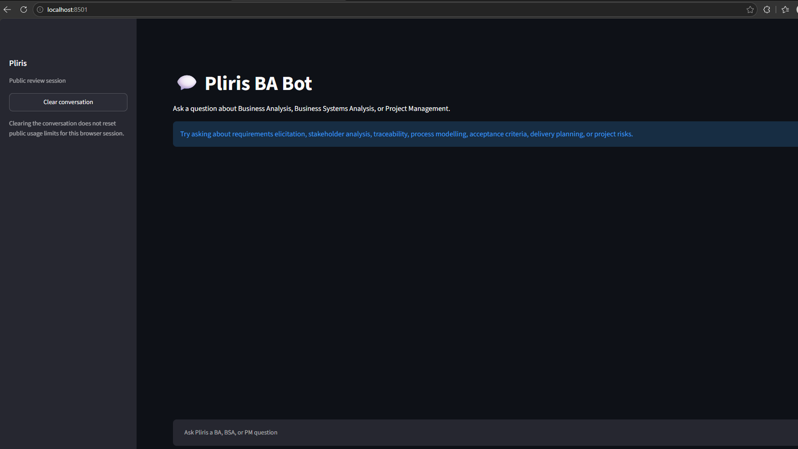

# Reviewer walkthrough

This walkthrough demonstrates the submission without exposing credentials or private corpus data.

1. Follow [setup](setup.md) and wait until all three containers are healthy.
2. Open <http://localhost:8501>. Confirm the sidebar and main page expose chat only.
3. Ask a Business Analysis question and inspect its grounded citations. Ask an unrelated or
   prompt-injection-style question and confirm the bounded refusal.
4. Open <http://localhost:8502>, unlock the developer interface, and inspect Sources, Response
   Feedback, Monitoring, and Health & Readiness.
5. On Health & Readiness, select Refresh. Confirm the checked timestamp and dependency latencies
   change while no secret or identifier is displayed.
6. Review the pull request's CI and Security audit checks. Download the SHA-addressed evidence and
   verify its summary, JSON/SARIF reports, SBOMs, CodeQL result, and final image identity.

## Captured acceptance views

The images contain only non-secret runtime configuration and local URLs. They demonstrate Phase 7
acceptance and are retained as Phase 8 reviewer evidence.
